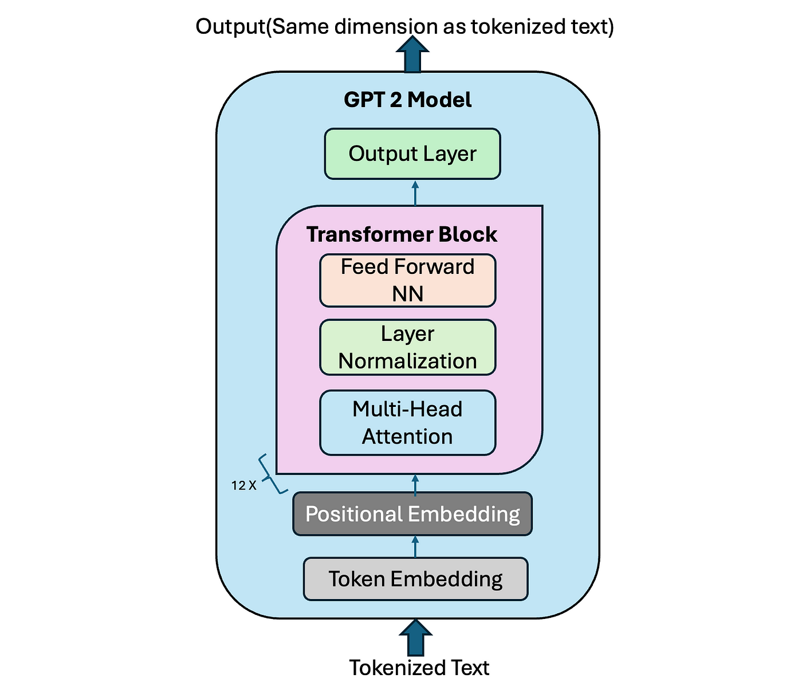

# Parameter-Efficient Fine-Tuning with LoRA

This repository contains experiments and implementations of **Parameter-Efficient Fine-Tuning (PEFT)** techniques, specifically **Low-Rank Adaptation (LoRA)** applied to GPT-2, on the **Stanford Question Answering Dataset (SQuAD)**.  
The project explores how to fine-tune large language models efficiently while reducing the number of trainable parameters, preserving performance, and lowering computational cost.

---

## Project Overview
- **Base Model:** GPT-2  
- **Dataset:** SQuAD (Stanford Question Answering Dataset)  
- **Objective:** Fine-tune GPT-2 on question answering tasks using LoRA instead of full fine-tuning.  
- **Key Idea:** Train only low-rank matrices added to frozen weights, drastically reducing trainable parameters.

---

## Key Concepts
- **Attention Mechanism:** Core to Transformer architectures, enabling contextual word representations.  
- **Transformer Architecture:** Encoder–decoder structure with self-attention, feed-forward networks, and positional encoding.  
- **GPT-2:** Decoder-only Transformer trained for next-token prediction.  
- **LoRA (Low-Rank Adaptation):**
  - Introduces low-rank decomposition (`W + BA`) for efficient fine-tuning.  
  - Significantly reduces the number of trainable parameters.  
  - Avoids updating all model weights.  

---

## GPT-2 Model Architecture

---

## Implementation Details
The notebook [`PEFT.ipynb`](./PEFT.ipynb) includes:

1. **Data Preprocessing**  
   - JSON parsing of SQuAD  
   - Context–question–answer extraction  
   - Tokenization, truncation, and masking  

2. **LoRA Fine-Tuning**  
   - Configurable `r` (rank), learning rate, and MLP adaptation  
   - Comparison across different LoRA configurations  

3. **Evaluation Metrics**  
   - Exact Match (EM)  
   - F1 Score  
   - Analysis of trade-offs between precision and diversity  

4. **Decoding Strategies**  
   - Greedy decoding  
   - Top-K sampling  
   - Nucleus sampling  
   - Temperature scaling  

---

## Training and Validation Loss

---

## Experimental Results

| Experiment | Name                   | r  | α (alpha) | Dropout | LR     | Target Modules               | Trainable Params | All Params   | Trainable % |
|------------|------------------------|----|-----------|---------|--------|------------------------------|------------------|--------------|-------------|
| 1          | exp_r4_lr1e-4_attn     | 4  | 16        | 0.1     | 0.0001 | ['c_attn']                   | 147,456          | 124,587,264  | 0.1184%     |
| 2          | exp_r8_lr2e-4_attn     | 8  | 16        | 0.1     | 0.0002 | ['c_attn']                   | 294,912          | 124,734,720  | 0.2364%     |
| 3          | exp_r16_lr5e-4_attn    | 16 | 16        | 0.1     | 0.0005 | ['c_attn']                   | 589,824          | 125,029,632  | 0.4717%     |
| 4          | exp_r8_lr2e-4_attn_mlp | 8  | 16        | 0.1     | 0.0002 | ['c_attn', 'mlp.c_proj']     | 663,552          | 125,103,360  | 0.5304%     |
| 5          | exp_r32_lr2e-4_attn_mlp| 32 | 32        | 0.1     | 0.0002 | ['c_attn', 'mlp.c_proj']     | 2,654,208        | 127,094,016  | 2.0884%     |

---

## Results & Findings
- Increasing **LoRA rank (r)** improved learning up to a point.  
- Adding LoRA to **MLP layers** increased representation power but risked overfitting.  
- Best results achieved with moderate LoRA rank (`r=8`) and careful regularization.  
- Final model reached ~40% EM and F1 on validation.  
- Decoding strategies showed:
  - **Greedy decoding**: Best for fact-based QA.  
  - **Temperature 0.7**: Balanced accuracy and diversity.  
  - **Top-K / Nucleus sampling**: Increased diversity but reduced factual accuracy.  

---
